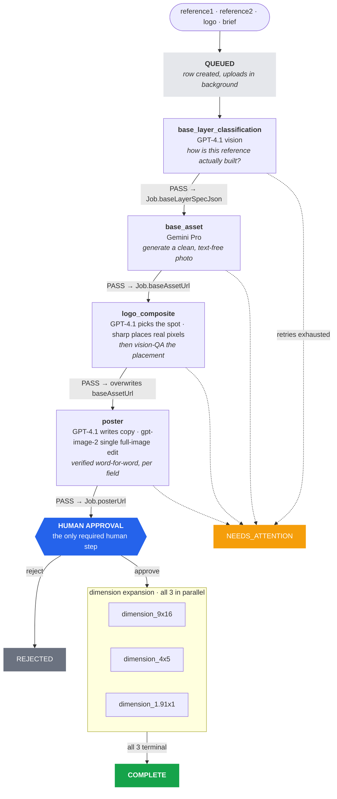
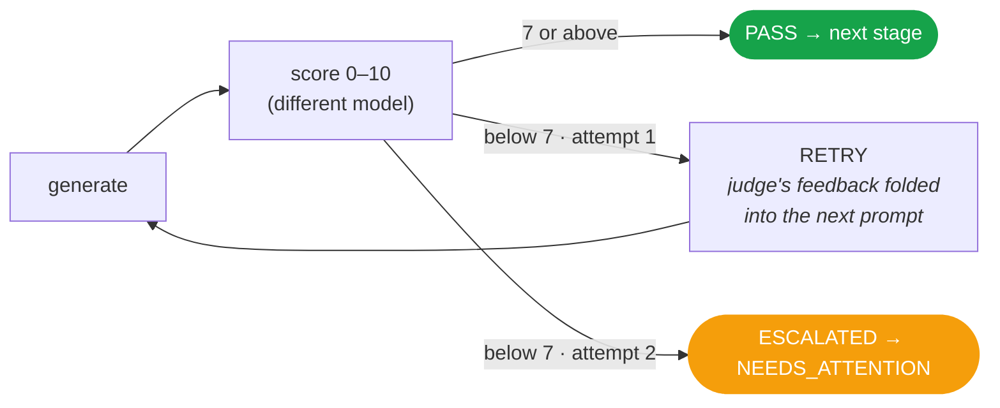
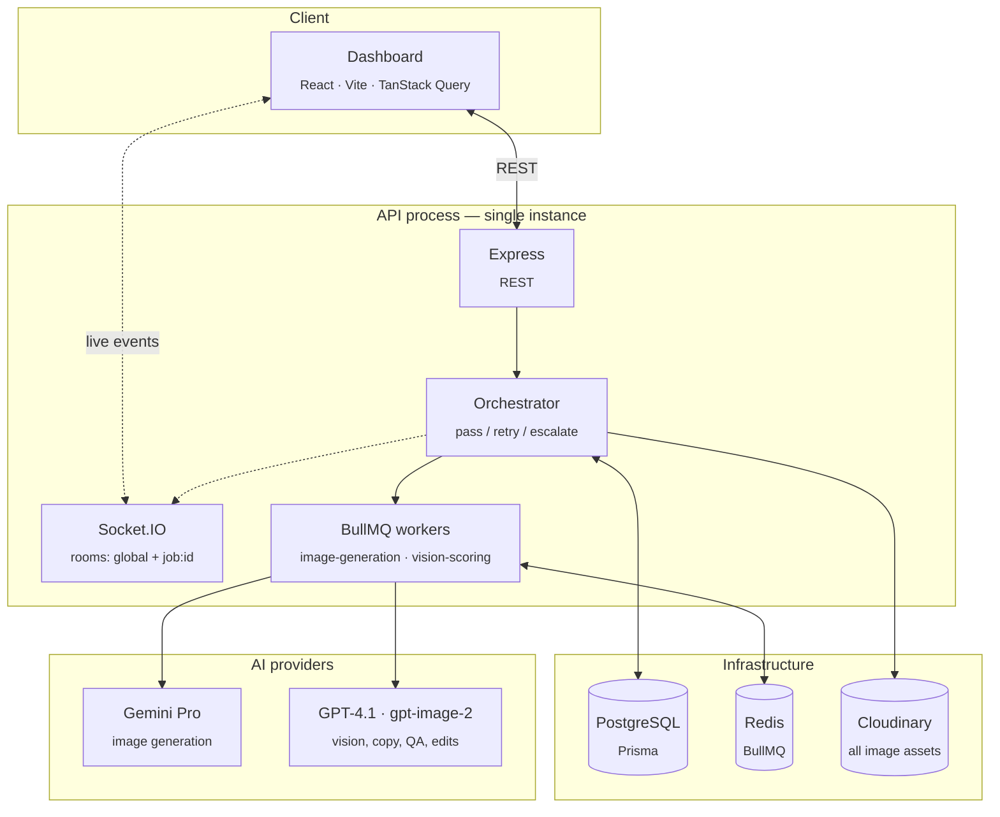
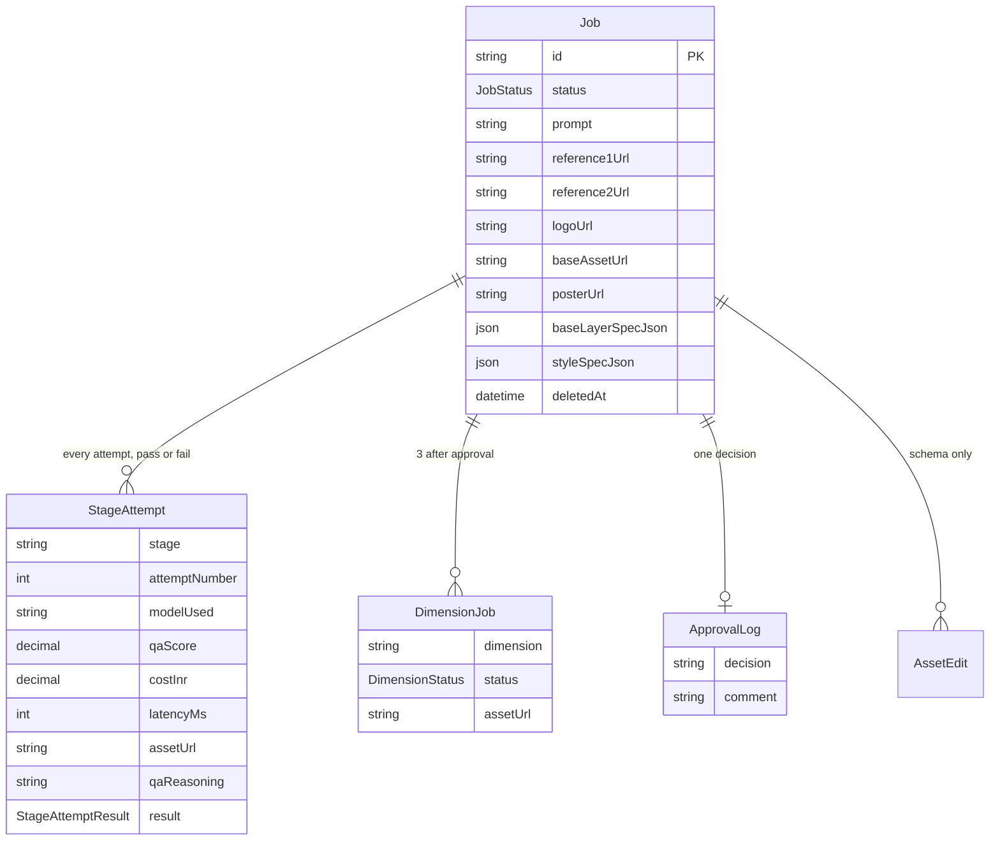

<div align="center">

# Automated Creative Production Pipeline

**Four inputs in. A complete, multi-format ad campaign out.**

Upload two reference images, a logo, and a text brief — get back a finished 1:1 poster
plus 9:16, 4:5 and 1.91:1 variants, with an AI quality gate at every step and exactly
one human approval in the middle.

[](https://bun.sh)
[](https://www.typescriptlang.org/)
[](https://www.prisma.io/)
[](https://docs.bullmq.io/)
[](https://socket.io/)
[](#testing)

</div>

---

## Table of contents

| | | |
|---|---|---|
| [Overview](#overview) | [Quick start](#quick-start) | [Performance & cost](#performance--cost) |
| [Pipeline](#the-pipeline) | [Quality gate](#the-quality-gate) | [Architecture](#architecture) |
| [HTTP API](#http-api) | [WebSocket API](#websocket-api) | [Data model](#data-model) |
| [Configuration](#configuration) | [Deployment](#deployment) | [Known gaps](#known-gaps) |

---

## Overview

### Inputs

| Input | What it's for |
|:--|:--|
| **Reference 1** | Subject / scenario direction — *what kind of photo this is* |
| **Reference 2** | Layout reference — *what the finished ad looks like* (headline, CTA, trust badges). The only image analysed structurally. |
| **Logo** | Brand logo, PNG or SVG |
| **Prompt** | Text brief: campaign theme, tone, copy direction (10–2000 chars) |

### Outputs

| Format | Size | Placement |
|:--|:--|:--|
| **1:1 poster** | 1024 × 1024 | The reviewed master creative |
| **9:16** | 1080 × 1920 | Stories / Reels — top 12% & bottom 14% kept clear of platform UI |
| **4:5** | 1080 × 1350 | Feed portrait |
| **1.91:1** | 1200 × 630 | Meta / LinkedIn link ads |

### Core principles

> **No model grades its own work.** Every generation is judged by a *different* model than the one that produced it.
>
> **Never silently ship something bad.** A failing score retries with the judge's own feedback folded into the next prompt. Still failing? It's parked in a **Needs Attention** queue for a human.
>
> **Never trust an AI number without checking it.** Every coordinate, ratio and size returned by a model is clamped into a valid range in code before anything renders.

> [!NOTE]
> Internal tool: no authentication, no multi-tenancy, single instance, trusted network.

---

## Quick start

```bash
bun install

cp .env.example .env          # fill in DB, Redis, Gemini, OpenAI, Cloudinary
cd apps/api && bunx prisma migrate dev && bunx prisma generate && cd ../..

bun run dev:api               # API + workers + Socket.IO  → :4000 (or $PORT)
bun run dev:dashboard         # Vite dashboard             → :5173
```

**Required services:** PostgreSQL (Supabase), Redis, and live Gemini / OpenAI / Cloudinary credentials.
Every provider call fails loudly if its key or model env var is missing — there are no silent fallbacks.

---

## Performance & cost

Real medians from production job history — **not estimates**. Stubbed test runs excluded.

| Stage | Median | p90 | Cost | Runs on |
|:--|--:|--:|--:|:--|
| `base_layer_classification` | 6.7s | 8.4s | ₹0.44 | vision-scoring queue |
| `base_asset` | 41.9s | 51.3s | ₹12.14 | image-generation queue |
| `logo_composite` | 10.3s | 14.7s | ₹0.88 | inline |
| `poster` | 80.9s | — | ₹15.53 | inline |
| `dimension_9x16` | 54.5s | 71.1s | ₹12.58 | image-generation queue |
| `dimension_4x5` | 58.8s | 71.3s | ₹12.58 | image-generation queue |
| `dimension_1.91x1` | 51.2s | 70.3s | ₹12.58 | image-generation queue |

<table>
<tr>
<td><b>~3.3 min</b><br/><sub>wall clock per job</sub></td>
<td><b>₹66.73</b><br/><sub>cost per job, no retries</sub></td>
<td><b>~11%</b><br/><sub>retry rate (base_asset / poster)</sub></td>
<td><b>206s</b><br/><sub>queue time per job</sub></td>
</tr>
</table>

### Throughput

At `IMAGE_GEN_CONCURRENCY=8`, the image-generation queue provides ~691,000 worker-seconds/day
against ~206s of queue work per job — roughly **3,300 jobs/day of theoretical capacity**.

| Load | Result |
|:--|:--|
| 300 jobs/day | ~9% of capacity |
| 30-job burst | Accepted in **4.9s**, drains in ~13 min |
| Peak memory under 30-concurrent | 196 MB, recovers to ~84 MB |
| Crashes / leaks observed | None |

> [!IMPORTANT]
> Throughput is not the binding constraint — **cost is**. At 300 jobs/day the spend is
> roughly **₹21,000/day (~₹6.3 lakh/month)**. The 3 dimension stages (₹37.74) and the
> poster edit (₹15.53) account for ~80% of it.

---

## The pipeline



### Stage by stage

<details>
<summary><b><code>base_layer_classification</code></b> — read the reference like a designer</summary>

<br/>

GPT-4.1 vision studies **reference2** and returns a freeform `BaseLayerSpec`: composition guide,
background treatment, and photo style (colour grading, lighting, setting, framing).

No fixed categories or archetypes — earlier versions bucketed references into a small set of
layouts and produced the wrong geometry when a real reference didn't fit. Validated only for
well-formedness, then cached once on `Job.baseLayerSpecJson` and reused by every downstream stage.

</details>

<details>
<summary><b><code>base_asset</code></b> — generate the clean photograph</summary>

<br/>

Gemini Pro generates a brand-new photo from the brief plus the classified style, with both
references attached so the model has a real visual target rather than a text description of one.

Hard constraints, both bookended at the start *and* end of the prompt (a single trailing mention
lost out to a detailed brief in practice):
- **No text of any kind** — all copy is composited later
- Objects whose only purpose is displaying text (race bibs, name tags) are omitted **entirely**, not rendered blank
- An explicit realism block: skin texture, natural asymmetry, no beauty-filter look

The QA rubric checks composition and realism against the *actual references*, and separately
verifies every concrete requirement named in the brief is genuinely visible. Output is force-cropped
square — Gemini has returned 1408×768 for a "1:1" request.

</details>

<details>
<summary><b><code>logo_composite</code></b> — decide and place, as one retryable unit</summary>

<br/>

The logo's **size** is computed deterministically (aspect-preserving, capped). Only its **position**
is an AI decision: GPT-4.1 sees the real photo plus every relevant number and returns one coordinate,
which is then clamped into valid bounds in code.

`sharp` composites the real logo pixels — `fit: 'contain'` with lanczos3 and a light sharpen pass,
because most logos are upscaled onto a 1024px canvas and `cover` was cropping wide logos into
illegible fragments. A vision QA then scores the *composited result*, because a placement can be
geometrically valid and still cover someone's face.

Decision and execution retry **together** — re-placing at the same AI-chosen coordinate would
fail identically every time.

</details>

<details>
<summary><b><code>poster</code></b> — the text layer</summary>

<br/>

Four steps, three models:

1. **Style extraction** — GPT-4.1 reads reference2 into a full `PosterStyleSpec` (margins, per-line headline styles, CTA shape, trust-list structure, element order). Every numeric ratio is clamped before use.
2. **Copy generation** — a cheap text-only call writes the actual words to the extracted structure. Returns `null` rather than inventing a fake price or a placeholder like "Event date".
3. **Render** — `gpt-image-2` does **one** full-image edit adding all text, with the logo's bounding box named as off-limits.
4. **Verification** — GPT-4.1 checks **8 fields independently** (headline, subtext, CTA, other elements, photo/logo untouched, no extra decoration, legibility, alignment), comparing against both the campaign reference and the exact pre-edit composite.

On retry, fields that already passed are **pinned to their exact previous wording** — regenerating
all copy meant a correct headline could come back worded differently and the edit model would render
the wrong one. Any single failed field caps the score below the pass threshold, so one real defect
can't hide behind a good average.

</details>

<details>
<summary><b>Human approval</b> — the one required human step</summary>

<br/>

The job parks at `AWAITING_APPROVAL` with no timeout. Approve fans out into all three dimensions;
reject is terminal. Available over both HTTP and WebSocket — note that only the **WebSocket** path
persists a rejection comment.

</details>

<details>
<summary><b><code>dimension_*</code></b> — recompose into three more canvases</summary>

<br/>

GPT-4.1 vision first **transcribes** the approved poster character-for-character, and the Gemini
prompt is then assembled *deterministically* from that transcription — the vision model's own prose
is never used as the instruction. This is what prevents duplicated and garbled headlines.

9:16 additionally reserves platform safe zones (top 12%, bottom 14%). Taller-than-square canvases
get explicit composition-balance guidance so the extra height is distributed rather than dumped into
one empty gap. Output is defensively resized to the exact target with `fit: 'cover'` — never stretched.

The QA judge is given **the source poster** and hard-fails on fidelity: a different subject, a
photographic element replaced with a vector one, an altered logo, or any text line appearing twice.

</details>

---

## The quality gate

Every AI-judged step follows the same rule:



| Setting | Value |
|:--|:--|
| Pass threshold | **7 / 10** |
| Max content-quality attempts | **2**, then escalate |
| Technical retries (network, 5xx, 429) | **3** with exponential backoff — entirely separate, never counted against the content cap |
| Failing dimension | Escalates **only itself** — never blocks its two siblings |

A human recovers an escalated job with `POST /jobs/:id/retry`, which resets that stage's attempt
count and re-dispatches it.

---

## Architecture



**Adding a stage** means writing one `StageDefinition` and importing it — the orchestrator contains
no stage names outside the registry.

```ts
interface StageDefinition {
  name: string;
  queue: 'image-generation' | 'vision-scoring';
  buildPrompt(job: Job, previousFeedback?: string): string;
  getInputAssetUrl(job: Job): string | undefined;
  nextStageOnPass: string | 'AWAITING_APPROVAL' | undefined;
  isDeterministic?: boolean;
  execute?(job: Job, prompt: string, inputAssetUrl?: string): Promise<StageResult>;
}
```

### Reliability

| Mechanism | Where |
|:--|:--|
| **Idempotent dispatch** — a duplicate attempt is a silent no-op, never a duplicate paid call | unique `(jobId, stage, attemptNumber)` |
| **Transaction-scoped decisions** — DB writes only; every slow side effect deferred to after commit | `handle-stage-result.ts` |
| **Retry on every outbound call** — providers *and* Cloudinary uploads | `http-client.ts`, `cloudinary.client.ts` |
| **Bounded concurrency** — queues, `/edit`, and background uploads all capped | `stalled-job-config.ts`, `semaphore.ts` |
| **Stalled-job recovery** — 5 min lock, well past the 286s worst case observed | `stalled-job-config.ts` |
| **Secret redaction** — auth headers and API keys stripped from every log line | `logger.ts` |
| **Full audit trail** — every attempt keeps its asset, score, reasoning, latency and cost, pass or fail | `StageAttempt` |

---

## HTTP API

Base path `/api/v1/jobs`. Every response is `{ data }` or `{ error: { code, message, details? } }`.

| Method | Endpoint | Description |
|:--|:--|:--|
| `POST` | `/` | Create a job — `multipart/form-data`. Returns in ~1s; uploads and dispatch continue in the background. |
| `GET` | `/` | List jobs — `?status=&limit=&offset=` |
| `GET` | `/:id` | Full job with stage attempts, dimensions and approval log |
| `PATCH` | `/:id` | Rename |
| `DELETE` | `/:id` | Soft-delete the row, hard-delete every Cloudinary asset |
| `POST` | `/:id/approve` | Approve → fans out all 3 dimensions |
| `POST` | `/:id/reject` | Reject (terminal) |
| `POST` | `/:id/edit` | Free-text "improve this" against the poster or one dimension, with an **optional reference image**. Synchronous, up to ~90s. |
| `POST` | `/:id/retry` | Recover a stuck job or one stuck dimension |

<details>
<summary>Error codes</summary>

<br/>

| Code | HTTP | Meaning |
|:--|:--|:--|
| `VALIDATION_ERROR` | 400 | Schema failure, missing file, or target asset doesn't exist yet |
| `UNSUPPORTED_FILE_TYPE` | 415 | Mimetype not accepted for that field |
| `FILE_TOO_LARGE` | 413 | References ≤ 15 MB, logo ≤ 5 MB |
| `JOB_NOT_FOUND` | 404 | Missing or soft-deleted |
| `INVALID_STATE_TRANSITION` | 409 | e.g. approving a job that isn't awaiting approval |
| `INTERNAL_ERROR` | 500 | Unhandled — logged server-side, generic message returned |

</details>

---

## WebSocket API

Socket.IO on the same port. Rooms are joined explicitly and **must be re-joined after a reconnect**.

**Client → server**

| Event | Payload |
|:--|:--|
| `join:job` | `{ jobId }` |
| `join:global` | — |
| `job:approval_response` | `{ jobId, decision, comment? }` |

**Server → client**

| Event | Payload | Rooms |
|:--|:--|:--|
| `job:status_changed` | `{ jobId, status, timestamp }` | job only |
| `job:approval_requested` | `{ jobId, posterUrl }` | job only |
| `job:needs_attention` | `{ jobId, stage, qaReasoning }` | job + global |
| `job:completed` | `{ jobId, dimensions[] }` | job + global |
| `feed:job_created` | `{ jobId, createdAt }` | global |
| `feed:job_deleted` | `{ jobId }` | job + global |

> [!WARNING]
> `job:approval_response` has **no acknowledgement and no error event**. A failure is only logged
> server-side. Clients should use a timeout fallback — the dashboard waits 15s.

---

## Data model



**`JobStatus`** · `QUEUED` → `BASE_LAYER_CLASSIFYING` → `BASE_ASSET_GENERATING` → `BASE_ASSET_SCORING` →
`LOGO_PLACEMENT_DETECTING` → `LOGO_COMPOSITING` → `POSTER_GENERATING` → `POSTER_SCORING` →
`AWAITING_APPROVAL` → `DIMENSION_EXPANDING` → `COMPLETE` · plus `NEEDS_ATTENTION` and `REJECTED`

> `Decimal` fields (`qaScore`, `costInr`) serialise to **strings** in JSON, not numbers.

---

## Configuration

| Variable | Purpose |
|:--|:--|
| `DATABASE_URL` / `DIRECT_URL` | Pooled runtime connection / direct connection for migrations |
| `REDIS_URL` | BullMQ |
| `GEMINI_API_KEY`, `GEMINI_PRO_MODEL` | Image generation |
| `OPENAI_API_KEY`, `OPENAI_VISION_MODEL` | Vision, copy, QA |
| `OPENAI_IMAGE_EDIT_MODEL` | The poster's full-image edit |
| `CLOUDINARY_*` | Asset storage |
| `PORT`, `NODE_ENV` | Server |

### Scaling knobs

| Variable | Default | Effect |
|:--|:--:|:--|
| `IMAGE_GEN_CONCURRENCY` | `8` | Parallel `base_asset` + `dimension_*` jobs |
| `VISION_SCORING_CONCURRENCY` | `8` | Parallel classification jobs |
| `JOB_UPLOAD_CONCURRENCY` | `4` | Background reference-upload groups |
| `EDIT_CONCURRENCY` | `8` | Concurrent `/edit` calls |

> [!TIP]
> Raise the concurrency values only as far as your Gemini/OpenAI rate limits and your Postgres
> pooler ceiling actually allow — and keep `connection_limit` on `DATABASE_URL` in step.

---

## Deployment

```bash
npm install -g pm2
pm2 start ecosystem.config.js
pm2 save && pm2 startup       # survive a reboot
```

Runs the API, Socket.IO and both workers as one supervised process with `NODE_ENV=production`,
auto-restart, and backoff on crash-loop.

### Testing

```bash
bun test              # 161 tests
bun run typecheck     # all workspaces
```

> [!NOTE]
> Stop the dev server before running tests — its workers share the same Redis and will consume the
> test suite's queued jobs.

---

## Known gaps

| Gap | Detail |
|:--|:--|
| **No auth** | No authentication, multi-tenancy or rate limiting. Trusted network only. |
| **Single instance** | API, Socket.IO and both workers share one process. Scaling out needs a Redis adapter for cross-instance socket rooms (`InterServerEvents` is reserved for exactly this). |
| **No spend controls** | Nothing caps cost on a workload running ~₹66/job. |
| **`AssetEdit` is unused** | The table exists with a full audit-trail shape; `editAsset()` overwrites URLs in place and never writes to it. |
| **HTTP reject drops the comment** | Only the WebSocket path persists `ApprovalLog.comment`. |
| **`GEMINI_FLASH_MODEL` unused** | Configured but never called — every generation uses Pro. Likely the single largest cost saving available. |
| **`dimension_*` is a full regeneration** | Rather than extending the clean photo and re-running the deterministic steps on the new canvas. |
| **No orphan reaper** | A crash mid-stage leaves `completedAt: null` with no automatic recovery. |

---

<div align="center">
<sub>Internal tool · Times Internet</sub>
</div>
